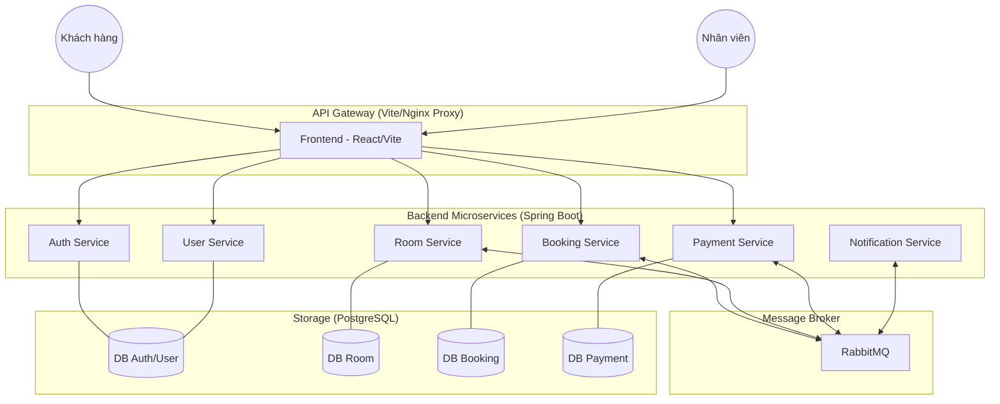

# 🏨 QLKS / HotelSystem (Microservices)

[](https://spring.io/projects/spring-boot)
[](https://react.dev/)
[](https://www.docker.com/)
[](https://www.rabbitmq.com/)
[](https://www.postgresql.org/)

Hệ thống quản lý khách sạn (QLKS) hiện đại được xây dựng trên kiến trúc Microservices, tập trung vào tính mở rộng, xử lý bất đồng bộ và quy tắc nghiệp vụ thực tế tại Việt Nam.

## 🏗️ Kiến trúc hệ thống



Mục tiêu của tài liệu này là giúp bạn:
1. Hiểu kiến trúc tổng quan của hệ thống.
2. Triển khai môi trường phát triển (Dev) và vận hành (Prod) nhanh chóng.
3. Nắm vững luồng nghiệp vụ và danh sách các API chính.

## Cấu trúc thư mục

- [HotelSystem/](HotelSystem/) — Frontend ReactJS (Vite + Tailwind) + Nginx config (production)
- [HotelSystem_Backend/](HotelSystem_Backend/) — 6 service Spring Boot (AUTH, USER, ROOM, BOOKING, PAYMENT, NOTIFICATION)
- [docker-compose.dev.yml](docker-compose.dev.yml) — Môi trường Dev (Vite proxy hot reload + `mvn spring-boot:run`)
- [docker-compose.yml](docker-compose.yml) — Môi trường Prod (build stack hoàn chỉnh: Nginx + frontend tĩnh + backend file `.jar`)
- [.env.example](.env.example) — Chứa danh sách các biến như cấu hình cổng và chữ ký của VNPAY Sandbox

## 2) Services, ports, URL

### Dev mode (docker-compose.dev.yml)

Frontend chạy Vite dev server:

- UI: http://localhost:3000

Backend (expose ra host):

- AUTH: http://localhost:8081
- USER: http://localhost:8082
- ROOM: http://localhost:8083
- BOOKING: http://localhost:8084
- PAYMENT: http://localhost:8085
- NOTIFICATION: http://localhost:8086

Hạ tầng:

- RabbitMQ Management: http://localhost:15672 (user/pass trong compose)
- pgAdmin: http://localhost:5050

Credentials mặc định (dev compose):

- RabbitMQ: `thaiquoc` / `123456`
- pgAdmin: `admin@gmail.com` / `123456`
- Postgres (mỗi DB): user `postgres`, pass `quocthai`

PostgreSQL (mỗi service 1 DB, map port ra host):

- auth: `localhost:55421`
- user: (dùng chung DB với auth trong compose)
- room: `localhost:55423`
- booking: `localhost:55424`
- payment: `localhost:55425`
- notification: `localhost:55426`

### API Gateway path (trong Frontend)

Frontend gọi backend qua proxy path (để tránh CORS và unify endpoint):

- `/auth-api/*` → AUTH (8081)
- `/user-api/*` → USER (8082)
- `/room-api/*` → ROOM (8083)
- `/booking-api/*` → BOOKING (8084)
- `/payment-api/*` → PAYMENT (8085)
- `/notification-api/*` → NOTIFICATION (8086)

Dev proxy nằm ở [HotelSystem/vite.config.ts](HotelSystem/vite.config.ts)

Prod proxy (Nginx) nằm ở [HotelSystem/nginx.conf](HotelSystem/nginx.conf)

## 3) Chạy hệ thống

### Cấu hình VNPAY qua .env

Project đã có file mẫu [`.env.example`](.env.example) cho cấu hình VNPAY.

1. Copy file mẫu thành `.env` ở thư mục root project.
2. Cập nhật các biến theo tài khoản Merchant của bạn.
3. Recreate `payment-service` để nạp biến môi trường mới.

Ví dụ lệnh:

```bash
copy .env.example .env
docker compose -f docker-compose.dev.yml up -d --force-recreate payment-service
```

Các biến đang dùng:

- `VNP_TMN_CODE`
- `VNP_HASH_SECRET`
- `VNP_PAY_URL`
- `VNP_RETURN_URL`
- `VNP_FRONTEND_RETURN_URL`

### Yêu cầu

- Windows: cài Docker Desktop và bật WSL2
- Docker Compose v2 (`docker compose ...`)

### Chạy DEV lần đầu (hoặc mỗi ngày)

```bash
docker compose -f docker-compose.dev.yml up -d
docker compose -f docker-compose.dev.yml ps
```

Xem log realtime:

```bash
docker compose -f docker-compose.dev.yml logs -f frontend
docker compose -f docker-compose.dev.yml logs -f booking-service
```

Restart 1 service khi vừa sửa code nhưng container chưa reload:

```bash
docker compose -f docker-compose.dev.yml restart booking-service
```

Tắt dev stack (không mất dữ liệu DB):

```bash
docker compose -f docker-compose.dev.yml down
```

Reset sạch toàn bộ DB volumes (xóa toàn bộ dữ liệu):

```bash
docker compose -f docker-compose.dev.yml down -v
```

### Sau khi tắt máy, mở lại để chạy project

1. Mở Docker Desktop và chờ trạng thái `Running`.
2. Mở terminal tại thư mục project.
3. Chạy lại stack dev:

```bash
docker compose -f docker-compose.dev.yml up -d
docker compose -f docker-compose.dev.yml ps
```

4. Mở ứng dụng:

- Frontend: http://localhost:3000
- RabbitMQ: http://localhost:15672
- pgAdmin: http://localhost:5050

### Dữ liệu có mất sau khi tắt máy không?

- Không mất nếu bạn chỉ tắt máy hoặc chạy `docker compose down`.
- Chỉ mất khi bạn xóa volume bằng `docker compose down -v` hoặc `docker volume prune`.

## 4) Kiểm tra dữ liệu trong PostgreSQL

Bạn có thể kiểm tra data theo 2 cách: `pgAdmin` hoặc `psql` trong container.

### Cách 1: pgAdmin (dễ nhìn)

1. Mở `http://localhost:5050`.
2. Đăng nhập:

- Email: `admin@gmail.com`
- Password: `123456`

3. Add server mới:

- Host: `postgres-auth` hoặc `postgres-room` hoặc `postgres-booking` hoặc `postgres-payment` hoặc `postgres-notification`
- Port: `5432`
- Username: `postgres`
- Password: `quocthai`

4. Vào `Query Tool` và chạy thử:

```sql
SELECT * FROM users LIMIT 20;
SELECT * FROM rooms LIMIT 20;
```

### Cách 2: psql trong terminal (nhanh)

Vào DB ROOM:

```bash
docker compose -f docker-compose.dev.yml exec postgres-room psql -U postgres -d hotel_room
```

Vào DB AUTH:

```bash
docker compose -f docker-compose.dev.yml exec postgres-auth psql -U postgres -d hotel_auth
```

Các lệnh psql cơ bản:

```sql
\dt
SELECT * FROM room_types LIMIT 10;
SELECT * FROM rooms LIMIT 10;
\q
```

## 5) Ghi chú dữ liệu mẫu (seed)

- `HotelSystem_ROOM` đã được chỉnh để không tự recreate schema mỗi lần start (`ddl-auto=update`).
- Seeder ROOM chỉ chạy khi bật `ROOM_SEED_ENABLED=true`.
- Sau khi seed lần đầu, đặt lại `ROOM_SEED_ENABLED=false` để tránh nạp lại dữ liệu mẫu.

### Chạy PROD (build image)

```bash
docker compose up -d --build
docker compose ps
```

Trong prod, frontend là Nginx (port 3000:80 theo compose) và Nginx reverse proxy về các backend.

## 6) Luồng nghiệp vụ chính (Đặt phòng & Thanh toán)

Hệ thống sử dụng RabbitMQ để phối hợp trạng thái giữa các service theo mô hình Event-driven:

1.  **Khởi tạo**: Khách hàng chọn phòng → `POST /booking-api/bookings`.
2.  **Giữ chỗ (Hold)**:
    *   BOOKING lưu trạng thái `PENDING_PAYMENT`, thiết lập **Hold Expiry (11 phút)**.
    *   Publish `room.hold` → ROOM chuyển trạng thái sang `HELD`.
3.  **Thanh toán (VNPAY)**:
    *   PAYMENT tạo link VNPAY với **Expire Date (10 phút)**.
    *   Khách hàng thanh toán thành công → Publish `payment.result (SUCCESS)`.
    *   BOOKING nhận kết quả → Cập nhật `CONFIRMED` hoặc `DEPOSIT_PAID`.
4.  **Hết hạn (Auto-expire)**:
    *   `BookingScheduler` quét mỗi phút. Nếu sau 11 phút chưa thanh toán → Chuyển `CANCELLED`.
    *   Publish `room.release` để ROOM mở lại phòng cho khách khác.
5.  **Hủy phòng & Hoàn tiền**:
    *   Khách hàng hủy phòng → BOOKING tính toán phí dựa trên **Cancellation Policy**.
    *   Nếu có hoàn tiền → `RefundService` tạo giao dịch hoàn tiền định danh (Idempotent).

## 7) Quy tắc nghiệp vụ (Vietnam Hotel Standard)

Hệ thống đã triển khai bộ quy tắc nghiệp vụ thực tế tại Việt Nam:

### Quy tắc Ngày Lễ / Tết
*   **Danh sách**: Tết Nguyên Đán (28/12 - 05/01 Âm lịch), Giỗ Tổ Hùng Vương (10/03 Âm lịch), 01/01, 30/04, 01/05, 02/09.
*   **Áp dụng**: Nếu bất kỳ ngày nào trong kỳ lưu trú rơi vào ngày lễ, toàn bộ booking sẽ áp dụng **Holiday Rules**.
*   **Chế độ**: Nhân hệ số giá **1.3x**, yêu cầu cọc **50%**, ở tối thiểu **2 đêm**, hủy miễn phí trước **72h**.

### Chính sách Hủy phòng (Cancellation Policy)
Hệ thống tự động tính toán phí hủy dựa trên thời điểm hủy so với giờ Check-in (14:00):
*   **Ngày thường**: Miễn phí hủy trước 24h. Hủy muộn mất phí 1 đêm đầu tiên. No-show mất toàn bộ tiền cọc/thanh toán.
*   **Ngày lễ**: Miễn phí hủy trước 72h. Hủy muộn mất toàn bộ tiền cọc (50%).

### Phụ thu Check-in sớm / Check-out trễ
*   **Check-in sớm**: Trước 06:00 (100% giá), 06:00 - 10:00 (50%), 10:00 - 14:00 (20%).
*   **Check-out trễ**: 12:00 - 14:00 (20%), 14:00 - 18:00 (50%), sau 18:00 (100%).

## 8) README theo module

- Frontend: [HotelSystem/README.md](HotelSystem/README.md)
- AUTH service: [HotelSystem_Backend/HotelSystem_AUTH/README.md](HotelSystem_Backend/HotelSystem_AUTH/README.md)
- USER service: [HotelSystem_Backend/HotelSystem_USER/README.md](HotelSystem_Backend/HotelSystem_USER/README.md)
- ROOM service: [HotelSystem_Backend/HotelSystem_ROOM/README.md](HotelSystem_Backend/HotelSystem_ROOM/README.md)
- BOOKING service: [HotelSystem_Backend/HotelSystem_BOOKING/README.md](HotelSystem_Backend/HotelSystem_BOOKING/README.md)
- PAYMENT service: [HotelSystem_Backend/HotelSystem_PAYMENT/README.md](HotelSystem_Backend/HotelSystem_PAYMENT/README.md)
- NOTIFICATION service: [HotelSystem_Backend/HotelSystem_NOTIFICATION/README.md](HotelSystem_Backend/HotelSystem_NOTIFICATION/README.md)

## 9) Troubleshoot
- **VNPAY 97**: Lỗi chữ ký hoặc checksum (Kiểm tra lại `VNP_HASH_SECRET` trong `.env`).
- **Phòng không giải phóng**: Kiểm tra `RabbitMQ Management` xem queue `room.release` có bị nghẽn không.
- **Lỗi ngày Âm lịch**: Thuật toán `HolidayService` sử dụng Jean Meeus algorithm, độ chính xác cao cho các năm 2000-2099.
