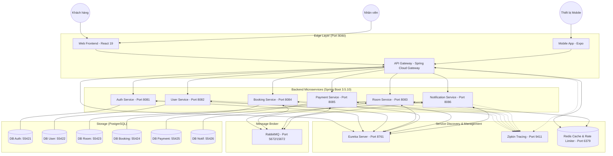

# 🏨 QLKS / HotelSystem (Microservices)

[](https://spring.io/projects/spring-boot)
[](https://react.dev/)
[](https://reactnative.dev/)
[](https://www.docker.com/)
[](https://www.rabbitmq.com/)
[](https://redis.io/)
[](https://www.postgresql.org/)

Hệ thống quản lý khách sạn (QLKS) toàn diện và hiện đại được xây dựng dựa trên kiến trúc **Microservices** (Spring Boot 3.5.10) kết hợp với giao diện **Web Staff & Customer** (React 19) và **Mobile App** (Expo/React Native) để quét QR & xác nhận thanh toán/check-in thời gian thực. Hệ thống nhấn mạnh tính mở rộng, xử lý bất đồng bộ qua hàng đợi thông điệp, khả năng chịu tải và bảo mật tối đa.

---

## 🏗️ Kiến trúc hệ thống



---

## 📂 Cấu trúc thư mục dự án

- [HotelSystem/](HotelSystem/) — Frontend ReactJS (Vite + Tailwind CSS + Framer Motion) cho Khách hàng & Nhân viên.
- [HotelSystem_Backend/](HotelSystem_Backend/) — 8 service Spring Boot 3.5.10 (AUTH, USER, ROOM, BOOKING, PAYMENT, NOTIFICATION, EUREKA, GATEWAY).
- [HotelSystem_Mobile/](HotelSystem_Mobile/) — Mobile App React Native Expo dành cho quản lý quét mã thanh toán/check-in QR ngoại tuyến và thời gian thực qua WebSocket.
- [docker-compose.dev.yml](docker-compose.dev.yml) — Cấu hình môi trường phát triển (Dev) hỗ trợ hot-reload cho cả code Java & Node modules.
- [docker-compose.yml](docker-compose.yml) — Cấu hình môi trường vận hành (Production) với các bundle hoàn chỉnh.
- [.env.example](.env.example) — Chứa danh sách các biến môi trường cho VNPAY/MoMo Sandbox.

---

## 🔌 Danh sách cổng kết nối & Dịch vụ

### Môi trường phát triển (Dev mode)

- **Cửa ngõ truy cập duy nhất (Entry Point)**:
  - **Web UI**: [http://localhost:3000](http://localhost:3000)
  - **API Gateway**: [http://localhost:8080](http://localhost:8080) (Mọi kết nối từ Web/Mobile bắt buộc đi qua đây)
- **Hạ tầng quản lý & Giám sát**:
  - **Eureka Discovery Dashboard**: [http://localhost:8761](http://localhost:8761)
  - **Zipkin Distributed Tracing**: [http://localhost:9411](http://localhost:9411) (Theo dõi luồng request và độ trễ liên service)
  - **RabbitMQ Management**: [http://localhost:15672](http://localhost:15672) (Mặc định: `thaiquoc` / `123456`)
  - **Redis Console**: Cổng `6379`
  - **pgAdmin DB UI**: [http://localhost:5050](http://localhost:5050) (Mặc định: `admin@gmail.com` / `123456`)

### Chi tiết cổng nội bộ & Cơ sở dữ liệu của Microservices

| Service          | Internal Port | Gateway Path           | PostgreSQL Port (External) | Database Name        |
| :--------------- | :-----------: | :--------------------- | :------------------------: | :------------------- |
| **GATEWAY**      |    `8080`     | `/*`                   |             -              | -                    |
| **AUTH**         |    `8081`     | `/auth-api/**`         |          `55421`           | `hotel_auth`         |
| **USER**         |    `8082`     | `/user-api/**`         |          `55422`           | `hotel_user`         |
| **ROOM**         |    `8083`     | `/room-api/**`         |          `55423`           | `hotel_room`         |
| **BOOKING**      |    `8084`     | `/booking-api/**`      |          `55424`           | `hotel_booking`      |
| **PAYMENT**      |    `8085`     | `/payment-api/**`      |          `55425`           | `hotel_payment`      |
| **NOTIFICATION** |    `8086`     | `/notification-api/**` |          `55426`           | `hotel_notification` |
| **EUREKA**       |    `8761`     | -                      |             -              | -                    |

---

## 🚀 Hướng dẫn khởi động nhanh

### 1) Thiết lập biến môi trường VNPAY/MoMo

Tạo file `.env` tại thư mục gốc của dự án và cập nhật thông số thẻ kiểm thử của bạn:

```bash
copy .env.example .env
```

Nội dung cơ bản bao gồm:

```env
VNP_TMN_CODE=E6BOARWZ
VNP_HASH_SECRET=O6OOMFFZPBLYQM9EGHLRTZEJUMPGCQZJ
VNP_PAY_URL=https://sandbox.vnpayment.vn/paymentv2/vpcpay.html
VNP_RETURN_URL=http://localhost:8085/payments/vnpay-return
VNP_FRONTEND_RETURN_URL=http://localhost:3000/payment-result
```

### 2) Khởi chạy bằng Docker Compose

Đảm bảo bạn đã bật Docker Desktop trên máy (Windows với WSL2). Tại thư mục gốc dự án chạy:

```bash
# Khởi động stack backend/dev, không chạy frontend
docker compose -f docker-compose.dev.yml up -d

# Xem trạng thái hoạt động của các service
docker compose -f docker-compose.dev.yml ps
```

Frontend đã được tách riêng bằng Docker profile `frontend`. Chỉ chạy Web UI ở cổng `3000` khi thật sự cần:

```bash
docker compose -f docker-compose.dev.yml --profile frontend up -d
```

Nếu muốn build lại từ đầu hoặc chạy bản Production hoàn chỉnh:

```bash
docker compose up -d --build
```

### 3) Đóng gói và Dọn dẹp dữ liệu

- Tắt hệ thống nhưng **không mất dữ liệu** trong database:
  ```bash
  docker compose -f docker-compose.dev.yml down
  ```
- Tắt hệ thống và **xóa sạch hoàn toàn** dữ liệu cũ để reset:
  ```bash
  docker compose -f docker-compose.dev.yml down -v
  ```
  Lưu ý: `down -v` xóa toàn bộ volume database. Sau thay đổi `spring.sql.init.mode=${SPRING_SQL_INIT_MODE:never}`, hệ thống sẽ không tự seed lại demo data khi khởi động lại. Nếu cần nạp lại demo data, chạy một lần với `SPRING_SQL_INIT_MODE=always` hoặc import SQL thủ công, rồi đổi lại `never` để tránh reset dữ liệu thao tác thật.

---

## ⚖️ Quy tắc nghiệp vụ cốt lõi (Vietnam Hotel Standard Rules)

Hệ thống triển khai chặt chẽ bộ quy tắc vận hành khách sạn tiêu chuẩn thực tế tại Việt Nam, tập trung vào tính tự động hóa thông qua `BookingConstants.java`:

### 1. Phân loại Ngày thường vs Ngày lễ

- **Ngày lễ áp dụng**: Tết Nguyên Đán (28/12 - 05/01 Âm lịch), Giỗ Tổ Hùng Vương (10/03 Âm lịch), Tết Dương Lịch (01/01), Ngày Giải phóng & Quốc tế Lao động (30/04 - 01/05), Quốc khánh (02/09).
- **Holiday Rules**: Nếu kỳ lưu trú dính bất kỳ ngày lễ nào:
  - **Hệ số nhân giá**: **1.3x** giá phòng tiêu chuẩn.
  - **Tỷ lệ đặt cọc bắt buộc**: **50%** tổng giá trị.
  - **Số đêm lưu trú tối thiểu**: **2 đêm**.
  - **Chính sách hủy**: Miễn phí hủy trước **72 giờ** so với mốc Check-in (14:00).
- **Normal Rules** (Ngày thường):
  - **Hệ số nhân giá**: **1.0x**.
  - **Tỷ lệ đặt cọc bắt buộc**: **30%** tổng giá trị.
  - **Số đêm lưu trú tối thiểu**: **1 đêm**.
  - **Chính sách hủy**: Miễn phí hủy trước **24 giờ** so với mốc Check-in (14:00).

### 2. Các gói giá đặt phòng (Rate Plans)

- **Gói Linh hoạt (Flexible)**:
  - Đặt cọc: **50%**.
  - Giảm giá: **0%**.
  - Cho phép hoàn tiền khi hủy: **Có** (Miễn phí hủy trước 24h).
  - Thay đổi thông tin đặt phòng: **Cho phép**.
- **Gói Không hoàn lại (Non-Refundable)**:
  - Đặt cọc: **100%** ngay khi đặt.
  - Giảm giá trực tiếp: **10%** tổng tiền phòng.
  - Cho phép hoàn tiền khi hủy: **Không**.
  - Thay đổi thông tin đặt phòng: **Không cho phép**.

### 3. Quy định Check-in sớm & Check-out trễ (Early Check-In / Late Check-Out)

- **Check-in sớm (Phụ thu dựa trên % giá 1 đêm)**:
  - Check-in **trước 07:00**: Phụ thu **100%** giá 1 đêm phòng.
  - Check-in **từ 07:00 đến 12:00**: Phụ thu **50%** giá 1 đêm phòng.
  - Check-in **từ 12:00 đến 14:00**: **0%** (Miễn phí nhận phòng sớm).
- **Check-out trễ (Phụ thu dựa trên % giá 1 đêm)**:
  - Trễ **dưới 30 phút**: **Miễn phí**.
  - Trễ **từ 12:00 đến 14:00**: Phụ thu **20%** giá 1 đêm phòng.
  - Trễ **từ 14:00 đến 18:00**: Phụ thu **50%** giá 1 đêm phòng.
  - Trễ **sau 18:00**: Phụ thu **100%** giá 1 đêm phòng.
### 4. Quy định Rời phòng sớm (Early Check-out Policy)

- Áp dụng khi khách rút ngắn kỳ lưu trú thực tế:
  - Số đêm tối thiểu bị tính phí: **2 đêm** (nếu đặt ít hơn 2 đêm hoặc rút xuống dưới 2 đêm, vẫn phải trả tối thiểu tiền 2 đêm).
  - Tỷ lệ hoàn trả: Hoàn lại **80%** tiền phòng của những đêm không sử dụng còn lại (sau khi đã khấu trừ số đêm tối thiểu).

### 5. Quy trình xử lý Hoàn tiền (Refund SLA)

Hệ thống có **2 luồng refund chính**:

**1) Refund do Hủy phòng (Cancel Booking)**

- Khi khách hủy phòng, `CancellationPolicyService` tính số tiền được hoàn (nếu có).
- Tạo `RefundTransaction` trạng thái **PENDING** và đẩy vào **Refund Queue** chung.
- Nhân viên **chủ động claim** refund (không random/auto assign).
- **SLA**: tối đa **48 giờ** để xử lý hoàn tiền.
- KPI mềm theo ca: nếu ca có >= 5 refund, mỗi nhân viên tối thiểu xử lý 2 refund (có thể xử lý nhiều hơn).
- Sau khi refund thành công, tiền về tài khoản khách **1-3 ngày làm việc** tùy ngân hàng/cổng thanh toán.

**2) Refund do Checkout sớm (Early Check-out)**

- Hệ thống tính lại tổng chi phí thực tế; nếu phát sinh tiền dư thì tạo refund.
- Nhân viên đang thực hiện checkout **trực tiếp xử lý refund**, **không đưa vào queue chung**.
- Refund được gửi qua **VNPAY Sandbox Refund API** nếu nguồn thanh toán là VNPAY; thanh toán tại quầy được hoàn trực tiếp.

- Cơ chế tự động ghi nhật ký kiểm toán (`RefundAuditService`) và giám sát tiến độ (`RefundSLAWatcher`) để cảnh báo trễ hạn.

---

## 🔄 Luồng nghiệp vụ cốt lõi bằng Event-Driven

Hệ thống sử dụng **RabbitMQ** để điều phối bất đồng bộ trạng thái đơn hàng và phòng để đảm bảo tính nhất quán (Eventual Consistency):

```
[Chọn phòng] -> POST /bookings -> Trạng thái PENDING_PAYMENT & Giữ phòng 11 phút (Hold Room)
                                       │ (Publish 'room.hold')
                                       ▼
                              [ROOM Service chuyển sang HELD]
                                       │
                                       ▼
                       [PAYMENT Service tạo link VNPAY (Hạn 10 phút)]
                                       │
                ┌──────────────────────┴──────────────────────┐
                ▼ (Khách thanh toán thành công)               ▼ (Quá hạn 11 phút hoặc Hủy)
     [Publish 'payment.result' (SUCCESS)]           [BookingScheduler tự động hủy]
                │                                             │ (Publish 'room.release')
                ▼                                             ▼
   [BOOKING chuyển sang CONFIRMED]                 [ROOM Service chuyển sang AVAILABLE]
   [Publish 'booking.confirmed']                              │
                │                                             ▼
                ▼                                   [BOOKING chuyển CANCELLED]
    [NOTIFICATION gửi Mail/SMS]
```

---

## 📱 Ứng dụng di động (HotelSystem_Mobile)

Dành riêng cho nhân viên và quản lý khách sạn để vận hành linh hoạt:

- **Công nghệ**: React Native, Expo, Expo-Camera.
- **Chức năng**:
  - Quét nhanh mã QR mã hóa thanh toán (`PAY-...`) hiển thị trên Web Staff Dashboard.
  - Xem trực quan thông tin đặt phòng, số tiền đã cọc, số tiền còn lại cần thu.
  - Sử dụng **WebSocket** (`/payment-api/ws/payments`) để lắng nghe kết quả thanh toán thành công tức thì từ cổng VNPAY/MoMo.
  - Chức năng xác nhận thanh toán tiền mặt ngoại tuyến (Offline Cash Confirm) trực tiếp từ điện thoại.
- **Hướng dẫn cài đặt nhanh**:
  ```bash
  cd HotelSystem_Mobile
  npm install
  npx expo start
  ```

---

## 📚 Tài liệu chi tiết cho từng Module

- 💻 **Web Frontend**: [HotelSystem/README.md](HotelSystem/README.md)
- 📱 **Mobile Application**: [HotelSystem_Mobile/README.md](HotelSystem_Mobile/README.md)
- 🚪 **API Gateway**: [HotelSystem_Backend/HotelSystem_GATEWAY/README.md](HotelSystem_Backend/HotelSystem_GATEWAY/README.md)
- 🔍 **Service Discovery**: [HotelSystem_Backend/HotelSystem_EUREKA/README.md](HotelSystem_Backend/HotelSystem_EUREKA/README.md)
- 🔐 **Authentication Service**: [HotelSystem_Backend/HotelSystem_AUTH/README.md](HotelSystem_Backend/HotelSystem_AUTH/README.md)
- 👤 **User Profile Service**: [HotelSystem_Backend/HotelSystem_USER/README.md](HotelSystem_Backend/HotelSystem_USER/README.md)
- 🏨 **Room Inventory Service**: [HotelSystem_Backend/HotelSystem_ROOM/README.md](HotelSystem_Backend/HotelSystem_ROOM/README.md)
- 📑 **Booking & Rules Service**: [HotelSystem_Backend/HotelSystem_BOOKING/README.md](HotelSystem_Backend/HotelSystem_BOOKING/README.md)
- 💳 **Payment Gateway Service**: [HotelSystem_Backend/HotelSystem_PAYMENT/README.md](HotelSystem_Backend/HotelSystem_PAYMENT/README.md)
- 🔔 **Notification Service**: [HotelSystem_Backend/HotelSystem_NOTIFICATION/README.md](HotelSystem_Backend/HotelSystem_NOTIFICATION/README.md)
